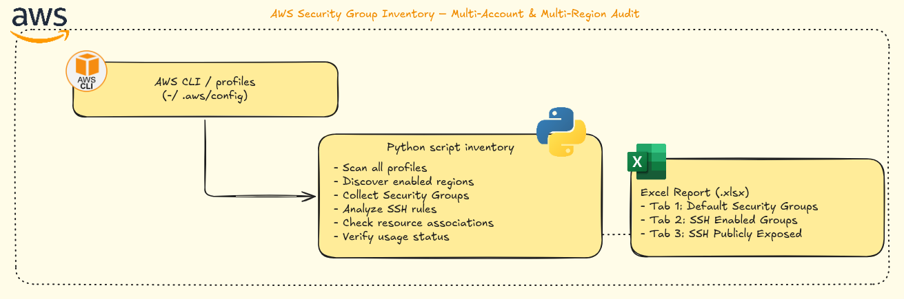

<div align="center">
  


# AWS Security Group Inventory – Auditoria Multi-Conta e Multi-Região

**Atualizado: 2 de Janeiro de 2025**

[](https://github.com/nicoleepaixao)
[](https://github.com/nicoleepaixao/aws-sg-inventory)
[](https://nicoleepaixao.medium.com/enforcing-region-based-governance-in-aws-with-scps-8b37e434805b)

<p align="center">
  <a href="README-PT.md">🇧🇷</a>
  <a href="README.md">🇺🇸</a>
</p>

</div>

---

<p align="center">
  
</p>

---

## **Visão Geral**

Este projeto implementa um inventário abrangente de Security Groups para ambientes AWS multi-conta e multi-região. A solução fornece uma visão consolidada de itens críticos de segurança, incluindo Security Groups padrão, grupos habilitados para SSH, acesso SSH publicamente exposto, associações de recursos e status de uso. Os resultados são gerados em um arquivo Excel organizado com três abas para facilitar auditoria, remediação e priorização.

---

## **Informações Importantes**

### **O Que Esta Solução Faz**

| **Aspecto** | **Detalhes** |
|------------|-------------|
| **Escopo** | Auditoria de Security Groups multi-conta e multi-região |
| **Detecção** | SGs padrão, regras SSH, exposição pública (0.0.0.0/0) |
| **Rastreamento de Recursos** | ENIs e instâncias EC2 associadas a cada SG |
| **Análise de Uso** | Identifica Security Groups não utilizados |
| **Formato de Saída** | Excel (.xlsx) com 3 abas organizadas |
| **Automação** | Script Python com perfis AWS CLI |

### **Por Que Isso Importa**

Em ambientes AWS distribuídos com múltiplas contas, é comum encontrar Security Groups que são:

- **Criados automaticamente** e nunca revisados
- **Deixados como padrão** mesmo quando desnecessário
- **Permitindo SSH** irrestrito da internet
- **Não utilizados** mas ainda presentes (desperdício operacional)
- **Associados a recursos sensíveis** sem governança adequada

### **Benefícios da Solução**

✅ **Governança Organizacional**: Implementar segurança a nível de organização  
✅ **Redução de Superfície de Ataque**: Identificar e remover configurações arriscadas  
✅ **Avaliação Rápida de Riscos**: Identificar rapidamente exposições de segurança  
✅ **Remediação Baseada em Evidências**: Criar planos apoiados por dados  
✅ **Suporte a Auditoria**: Apoiar processos de compliance, FinOps e SRE

---

## **Como Funciona**

### **1. Escaneamento Multi-Conta**

O script processa múltiplos perfis AWS definidos em `~/.aws/config`:

```ini
[profile dev-account]
region = us-east-1

[profile staging-account]
region = us-east-1

[profile production-account]
region = us-east-1
```

### **2. Descoberta de Regiões Habilitadas**

Filtra automaticamente regiões que são:

- **Habilitadas** na conta
- **Não requerem opt-in**, ou já foram habilitadas pela equipe
- **Evitando erros AuthFailure**

### **3. Coleta Detalhada de Security Groups**

Para cada Security Group, o inventário captura:

| **Ponto de Dados** | **Descrição** |
|----------------|----------------|
| **ID e Nome** | Identificador e nome do Security Group |
| **Conta/Região** | Conta de origem e região AWS |
| **VPC** | Virtual Private Cloud associada |
| **Regras SSH** | Regras relevantes envolvendo porta 22 |
| **Exposição Pública** | Se SSH está aberto para 0.0.0.0/0 ou ::/0 |
| **Status Padrão** | Se é um Security Group padrão |

### **4. Verificação de Uso**

O script identifica se o SG está sendo usado por:

- **Elastic Network Interfaces (ENIs)**
- **Instâncias EC2**
- **Outros recursos** usando interfaces de rede

### **5. Classificação de Risco**

| **Nível de Risco** | **Critério** |
|----------------|-------------|
| **Crítico** | SG com SSH aberto ao mundo E em uso |
| **Alto** | SG padrão associado a instâncias |
| **Médio** | SG com SSH aberto mas não usado (pode remover) |
| **Baixo** | SGs não utilizados (limpeza operacional) |

---

## **Estrutura do Relatório Excel**

### **Aba 1: default_sg**

Lista todos os Security Groups padrão através de contas e regiões.

### **Aba 2: ssh_open**

Security Groups contendo regras na porta 22.

### **Aba 3: ssh_world**

Security Groups com SSH exposto para 0.0.0.0/0 ou ::/0 (voltado à internet).

### **Definições de Colunas**

| **Coluna** | **Descrição** |
|------------|-----------------|
| `account_profile` | Conta/perfil AWS analisado |
| `account_id` | ID da conta AWS |
| `region` | Região AWS |
| `security_group_id` | ID do Security Group |
| `group_name` | Nome do Security Group |
| `vpc_id` | VPC associada |
| `is_default` | É SG padrão (True/False) |
| `has_ssh_rule` | Tem permissão SSH (True/False) |
| `has_ssh_open_world` | SSH aberto à internet (True/False) |
| `in_use` | Associado a algum recurso (True/False) |
| `attached_eni_count` | Número de ENIs usando este SG |
| `attached_resources` | Lista de ENIs/instâncias anexadas |
| `ssh_rules` | Descrição das regras SSH encontradas |

---

## **Como Começar**

### **1. Clonar Repositório**

```bash
git clone https://github.com/nicoleepaixao/aws-sg-inventory-audit.git
cd aws-sg-inventory-audit
```

### **2. Instalar Dependências**

```bash
pip install -r requirements.txt
```

**requirements.txt:**
```text
boto3
pandas
xlsxwriter
```

### **3. Configurar Perfis AWS**

Configure seus perfis AWS em `~/.aws/config`:

```ini
[profile dev-account]
region = us-east-1
role_arn = arn:aws:iam::111111111111:role/SecurityAudit
source_profile = management

[profile staging-account]
region = us-east-1
role_arn = arn:aws:iam::222222222222:role/SecurityAudit
source_profile = management

[profile production-account]
region = us-east-1
role_arn = arn:aws:iam::333333333333:role/SecurityAudit
source_profile = management
```

### **4. Atualizar Configuração do Script**

Edite `sg_inventory_excel.py` para especificar seus perfis:

```python
PROFILES = [
    "dev-account",
    "staging-account",
    "production-account",
]
```

**Nota:** Certifique-se de que os perfis têm permissões de leitura EC2 (`ec2:DescribeSecurityGroups`, `ec2:DescribeNetworkInterfaces`, `ec2:DescribeInstances`).

---

## **Executando o Inventário**

1. **Executar Script:**
   ```bash
   python sg_inventory_excel.py
   ```

2. **Monitorar Progresso:** O script escaneará todos os perfis e regiões configurados

3. **Revisar Saída:** Arquivo Excel gerado com timestamp

**Exemplo de saída:**
```text
security_groups_inventory_20251206T210355.xlsx
```

4. **Analisar Resultados:** Abra o arquivo Excel e revise cada aba para os achados

---

## **Entendendo os Resultados**

### **Exemplo: Aba Security Groups Padrão**

| account_profile | account_id | region | security_group_id | group_name | is_default | in_use | attached_eni_count | attached_resources |
|-----------------|------------|--------|-------------------|------------|------------|--------|-------------------|-------------------|
| production | 123456789012 | us-east-1 | sg-0abc123 | default | True | True | 3 | eni-0123, i-0abc456 |
| dev | 987654321098 | sa-east-1 | sg-0def456 | default | True | False | 0 | |

### **Exemplo: Aba SSH Exposto ao Mundo**

| account_profile | region | security_group_id | group_name | has_ssh_open_world | in_use | ssh_rules |
|-----------------|--------|-------------------|------------|-------------------|--------|-----------|
| production | us-east-1 | sg-0xyz789 | web-servers | True | True | 0.0.0.0/0 -> 22 |
| staging | eu-west-1 | sg-0abc123 | test-sg | True | False | ::/0 -> 22 |

### **Estratégias de Análise**

- **Filtrar por `in_use = True` + `has_ssh_open_world = True`**: Riscos imediatos de segurança
- **Filtrar por `is_default = True` + `in_use = True`**: Problemas de governança
- **Filtrar por `in_use = False`**: Oportunidades de limpeza
- **Ordenar por `attached_eni_count`**: Priorizar remediações de alto impacto

---

## **Casos de Uso**

| **Caso de Uso** | **Aplicação** |
|--------------|-----------------|
| **Auditoria de Segurança** | Identificar configurações inseguras rapidamente |
| **Planejamento de Remediação** | Saber quais SGs podem ser corrigidos sem impacto |
| **Redução de Superfície de Ataque** | Remover Security Groups obsoletos ou expostos |
| **Governança Multi-Conta** | Visão consolidada através da organização |
| **Suporte SRE/SecOps** | Análise rápida e decisões baseadas em dados |
| **Compliance** | Evidências para auditorias e revisões de compliance |

---

## **Melhores Práticas de Segurança**

### **Ações Imediatas**

| **Prioridade** | **Ação** | **Alvo** |
|--------------|-----------|------------|
| **Crítico** | Remover regras SSH 0.0.0.0/0 | Grupos com `has_ssh_open_world = True` e `in_use = True` |
| **Alto** | Substituir SGs padrão | Grupos com `is_default = True` e `in_use = True` |
| **Médio** | Deletar SGs não utilizados | Grupos com `in_use = False` |
| **Baixo** | Documentar propósito do SG | Todos os grupos com nomes personalizados |

### **Workflow Recomendado**

1. **Identificar Riscos Críticos**: SSH aberto ao mundo + em uso
2. **Criar SGs Substitutos**: Com faixas CIDR restritas
3. **Migrar Recursos**: De SGs arriscados para seguros
4. **Validar Mudanças**: Garantir conectividade mantida
5. **Remover SGs Antigos**: Limpar após migração bem-sucedida
6. **Documentar**: Atualizar runbooks e diagramas de arquitetura

---

## **Funcionalidades**

| **Funcionalidade** | **Descrição** |
|-------------|-----------------|
| **Suporte Multi-Conta** | Escanear contas AWS ilimitadas via perfis |
| **Cobertura Multi-Região** | Descoberta e escaneamento automático de regiões |
| **Detecção SSH** | Identificar todas as regras SSH (porta 22) |
| **Verificação de Exposição Pública** | Sinalizar blocos CIDR 0.0.0.0/0 e ::/0 |
| **Rastreamento de SG Padrão** | Encontrar todos os Security Groups padrão |
| **Análise de Uso** | Determinar se SG está anexado a recursos |
| **Associação ENI** | Contar e listar interfaces de rede |
| **Rastreamento de Instâncias EC2** | Identificar instâncias usando cada SG |
| **Exportação Excel** | Três abas organizadas para análise fácil |
| **Nomenclatura com Timestamp** | Nomes únicos de arquivo para controle de versão |

---

## **Tecnologias Utilizadas**

| **Tecnologia** | **Versão** | **Propósito** |
|----------------|-------------|-------------|
| Python | 3.8+ | Linguagem de script principal |
| boto3 | Mais recente | SDK AWS para chamadas API EC2 |
| pandas | Mais recente | Manipulação e organização de dados |
| xlsxwriter | Mais recente | Geração de arquivo Excel |
| AWS CLI | Mais recente | Gerenciamento de perfis e credenciais |

---

## **Estrutura do Projeto**

```text
aws-sg-inventory-audit/
│
├── README.md                          # Documentação completa do projeto
│
├── sg_inventory_excel.py              # Script principal de inventário
│
├── requirements.txt                   # Dependências Python
│
└── .gitignore                         # Arquivos ignorados (*.xlsx, venv/)
```

---

## **Informações Adicionais**

Para mais detalhes sobre AWS Security Groups, segurança VPC e melhores práticas, consulte:

- [AWS Security Groups Documentation](https://docs.aws.amazon.com/vpc/latest/userguide/VPC_SecurityGroups.html) - Guia oficial
- [VPC Security Best Practices](https://docs.aws.amazon.com/vpc/latest/userguide/vpc-security-best-practices.html) - Recomendações de segurança
- [EC2 Security Group Rules](https://docs.aws.amazon.com/AWSEC2/latest/UserGuide/security-group-rules.html) - Configuração de regras
- [AWS Security Hub](https://aws.amazon.com/security-hub/) - Verificações automatizadas de segurança

---

## **Conecte-se & Siga**

Mantenha-se atualizado com automação de segurança AWS e melhores práticas:

<div align="center">

[](https://github.com/nicoleepaixao)
[](https://www.linkedin.com/in/nicolepaixao/)
[](https://medium.com/@nicoleepaixao)

</div>

---

## **Aviso Legal**

Esta ferramenta realiza operações somente-leitura e não modifica nenhum recurso AWS. Configurações de Security Groups, comportamento de serviços AWS e melhores práticas podem evoluir com o tempo. Sempre valide os achados em ambientes de não-produção antes de implementar mudanças em Security Groups de produção. Consulte a documentação oficial da AWS e as políticas de segurança da sua organização.

---

<div align="center">

**Proteja sua infraestrutura AWS com segurança!**

*Documento atualizado em: 2 de Janeiro de 2025*

Made with ❤️ by [Nicole Paixão](https://github.com/nicoleepaixao)

</div>
